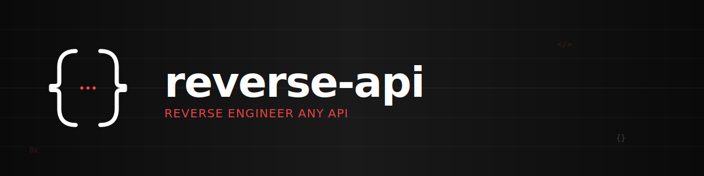

<div align="center">
  
</div>

# Reverse API Engineer

[](https://badge.fury.io/py/reverse-api-engineer)
[](https://www.python.org/downloads/)
[](https://opensource.org/licenses/MIT)

CLI tool that captures browser traffic and automatically generates production-ready Python API clients. No more manual reverse engineering—just browse, capture, and get clean API code.


## ✨ Features

- 🌐 **Browser Automation**: Built on Playwright with stealth mode for realistic browsing
- 🤖 **Autonomous Agent Mode**: Fully automated browser interaction using AI agents (browser-use, stagehand)
- 📊 **HAR Recording**: Captures all network traffic in HTTP Archive format
- 🧠 **AI-Powered Generation**: Uses Claude 4.5 to analyze traffic and generate clean Python code
- 🔌 **OpenCode SDK Support**: Native integration with OpenCode SDK for more flexibility
- 💻 **Interactive CLI**: Minimalist terminal interface with mode cycling (Shift+Tab)
- 📦 **Production Ready**: Generated scripts include error handling, type hints, and documentation
- 💾 **Session History**: All runs saved locally with full message logs
- 💰 **Cost Tracking**: Detailed token usage and cost estimation with cache support
- 🔑 **Multi-Provider Support**: Supports Browser-Use and Stagehand agent providers with multiple LLM options

## Limitations

- This tool executes code locally using Claude Code please monitor output.

- Some websites employ advanced bot-detection and anti-automation protections, which may limit capture or require additional manual interaction.

## 🚀 Installation

### Using pip
```bash
# Basic installation (manual and engineer modes)
pip install reverse-api-engineer

# With agent mode support
pip install 'reverse-api-engineer[agent]'

# Install browser-use with HAR recording support (required for agent mode)
pip install git+https://github.com/browser-use/browser-use.git@49a345fb19e9f12befc5cc1658e0033873892455
```

### Using uv (recommended)
```bash
# Basic installation
uv tool install reverse-api-engineer

# With agent mode support (includes browser-use with HAR recording)
uv tool install 'reverse-api-engineer[agent]' --with 'browser-use @ git+https://github.com/browser-use/browser-use.git@49a345fb19e9f12befc5cc1658e0033873892455'
```

### From source
```bash
git clone https://github.com/kalil0321/reverse-api-engineer.git
cd reverse-api-engineer
uv sync
```

### Post-installation
Install Playwright browsers:
```bash
playwright install chromium
```

## 📖 Usage

### Quick Start

Launch the interactive CLI:
```bash
reverse-api-engineer
```

The CLI has three modes (cycle with **Shift+Tab**):
- **manual**: Full pipeline (browser capture + AI generation)
- **engineer**: Reverse engineer from existing run_id
- **agent**: Autonomous browser agent + capture (fully automated)

### Manual Mode (Full Pipeline)

1. Start the CLI: `reverse-api-engineer`
2. Enter your task description (e.g., "Fetch Apple job listings")
3. Optionally provide a starting URL
4. Browse and interact with the website
5. Close the browser when done
6. AI automatically generates the API client

Generated scripts are saved to:
- `~/.reverse-api/runs/scripts/{run_id}/` (permanent storage)
- `./scripts/{descriptive_name}/` (local copy with readable name)

### Engineer Mode (Re-process existing captures)

Re-run AI generation on a previous capture:
```bash
# In CLI, switch to engineer mode (Shift+Tab) and enter run_id
# Or use command line:
reverse-api-engineer engineer <run_id>
```

### Agent Mode (Autonomous Browser Agent)

Fully automated browser interaction using AI agents:

1. Install with agent support (see installation instructions above for pip or uv)
2. Start the CLI: `reverse-api-engineer`
3. Switch to agent mode (Shift+Tab until you see `[agent]`)
4. Enter your task description (e.g., "Click on the first job listing")
5. Optionally provide a starting URL
6. The agent automatically navigates and interacts with the website
7. HAR is captured automatically
8. Optionally run reverse engineering to generate API client

**Important:** Browser-use must be installed from the specific git commit shown in the installation instructions above. This version includes HAR recording support which is not yet available in the PyPI release.

**Agent Provider Configuration:**
- **Browser-Use** (default): Supports Browser-Use LLM, OpenAI, and Google models
- **Stagehand**: Supports OpenAI and Anthropic Computer Use models

**Agent Model Configuration:**
- **Browser-Use Provider**:
  - **Browser-Use LLM**: Requires `BROWSER_USE_API_KEY`
  - **OpenAI Models**: Format `openai/{model}` (e.g., `openai/gpt-4`), requires `OPENAI_API_KEY`
  - **Google Models**: Format `google/{model}` (e.g., `google/gemini-pro`), requires `GOOGLE_API_KEY`
- **Stagehand Provider**:
  - **OpenAI Computer Use Models**: Format `openai/{cua-model}` (e.g., `openai/computer-use-preview-2025-03-11`), requires `OPENAI_API_KEY`
  - **Anthropic Computer Use Models**: Format `anthropic/{cua-model}` (e.g., `anthropic/claude-sonnet-4-5-20250929`), requires `ANTHROPIC_API_KEY`
  - Note: Stagehand only supports Computer Use Agents (CUA) models

Configure agent provider and model in `/settings` → "agent provider" and "agent model"

### CLI Commands

While in the CLI, use these slash commands:
- `/settings` - Configure model, agent model, SDK, and output directory
- `/history` - View past runs with costs
- `/messages <run_id>` - View detailed message logs
- `/help` - Show all commands
- `/exit` - Quit

### Model Selection

Choose from Claude 4.5 models:
- **Sonnet 4.5** (default): Balanced performance and cost
- **Opus 4.5**: Maximum capability for complex APIs
- **Haiku 4.5**: Fastest and most economical

Change model in `/settings` or via CLI:
```bash
reverse-api-engineer manual --model claude-sonnet-4-5
```

## 🔧 Configuration

Settings are stored in `~/.reverse-api/config.json`:
```json
{
  "model": "claude-sonnet-4-5",
  "sdk": "claude",
  "agent_provider": "browser-use",
  "agent_model": "bu-llm",
  "output_dir": null
}
```

### Agent Provider Configuration

The `agent_provider` setting controls which browser automation library is used:
- **`browser-use`** (default): Browser-Use library with support for multiple LLM providers
- **`stagehand`**: Stagehand library with OpenAI and Anthropic Computer Use models

### Agent Model Configuration

The `agent_model` setting controls which LLM is used for autonomous browser agents:

**For Browser-Use Provider:**
- **`bu-llm`** (default): Browser-Use's own LLM
  - Requires: `BROWSER_USE_API_KEY` environment variable
- **`openai/{model}`**: OpenAI models (e.g., `openai/gpt-4`, `openai/gpt-3.5-turbo`)
  - Requires: `OPENAI_API_KEY` environment variable
  - Optional: Install `langchain-openai` for additional model support
- **`google/{model}`**: Google models (e.g., `google/gemini-pro`, `google/gemini-1.5-pro`)
  - Requires: `GOOGLE_API_KEY` environment variable
  - Optional: Install `langchain-google-genai` for additional model support

**For Stagehand Provider:**
- **`openai/{cua-model}`**: OpenAI Computer Use models (e.g., `openai/computer-use-preview-2025-03-11`)
  - Requires: `OPENAI_API_KEY` environment variable
  - Supported models: `computer-use-preview-2025-03-11`
- **`anthropic/{cua-model}`**: Anthropic Computer Use models (e.g., `anthropic/claude-sonnet-4-5-20250929`)
  - Requires: `ANTHROPIC_API_KEY` environment variable
  - Supported models: `claude-sonnet-4-5-20250929`, `claude-haiku-4-5-20251001`, `claude-opus-4-5-20251101`
- Note: Stagehand's `agent.execute()` mode only supports Computer Use Agents (CUA)

**Setting API Keys:**
```bash
# Browser-Use (default)
export BROWSER_USE_API_KEY="your-api-key"

# OpenAI (required for OpenAI models and Stagehand)
export OPENAI_API_KEY="your-api-key"

# Anthropic (required for Anthropic models with Stagehand)
export ANTHROPIC_API_KEY="your-api-key"

# Google (for Browser-Use only)
export GOOGLE_API_KEY="your-api-key"
```

Change agent provider and model in `/settings` → "agent provider" and "agent model" or edit `config.json` directly.

### SDK Selection

Choose between two SDKs:
- **OpenCode**: Uses OpenCode SDK for AI-powered reverse engineering. Requires OpenCode to be running locally.
- **Claude** (default): Direct integration with Anthropic's Claude API.

Change SDK in `/settings` or edit `config.json` directly. When using OpenCode SDK, ensure OpenCode is running (`opencode` command).

## 📁 Project Structure

```
~/.reverse-api/
├── config.json          # User settings
├── history.json         # Run history with metadata
└── runs/
    ├── har/{run_id}/    # Captured HAR files
    ├── scripts/{run_id}/ # Generated API clients
    └── messages/{run_id}.jsonl # Full message logs
```

## 💡 Examples

### Example: Reverse Engineering a Job Board API

```bash
$ reverse-api-engineer
> fetch all apple jobs from their careers page

# Browser opens, you navigate and interact
# Close browser when done

# AI generates:
# - api_client.py (full API implementation)
# - README.md (documentation)
# - example_usage.py (usage examples)

# Scripts copied to: ./scripts/apple_jobs_api/
```

Generated `api_client.py` includes:
- Authentication handling
- Clean function interfaces
- Type hints and docstrings
- Error handling
- Production-ready code

## 🗺️ Roadmap

### SDK Support
- ✅ **Claude** - Integration with Claude Code
- ✅ **OpenCode** - Integration with OpenCode
- 🔄 **Codex** - Codex SDK support


## 🛠️ Development

### Setup
```bash
git clone https://github.com/kalil0321/reverse-api-engineer.git
cd reverse-api-engineer
uv sync
```

### Run locally
```bash
uv run reverse-api-engineer
```

### Build
```bash
uv build
```

## 🔐 Requirements

- Python 3.11+
- Claude Code / OpenCode (for reverse engineering)
- Playwright browsers installed
- API key for agent mode (see [Agent Model Configuration](#agent-model-configuration))

## 🤝 Contributing

Contributions are welcome! Please feel free to submit a Pull Request.

## 📄 License

This project is licensed under the MIT License - see the [LICENSE](LICENSE) file for details.
